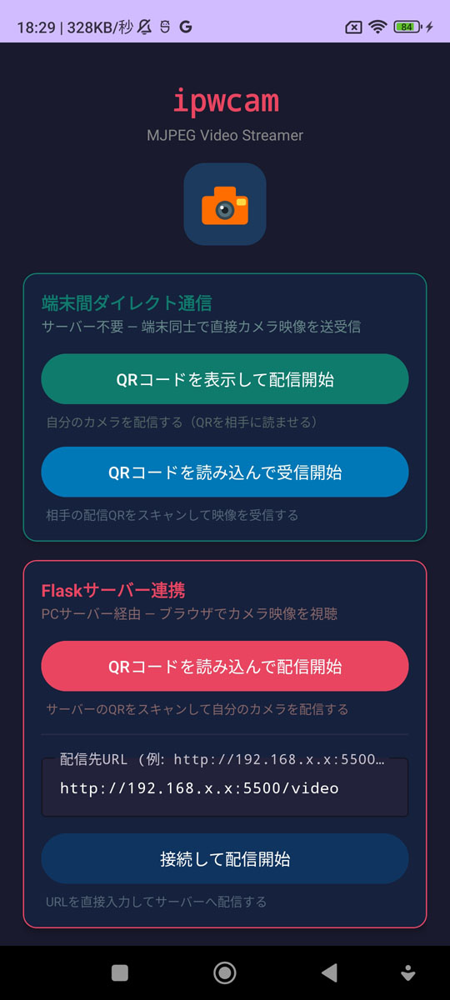
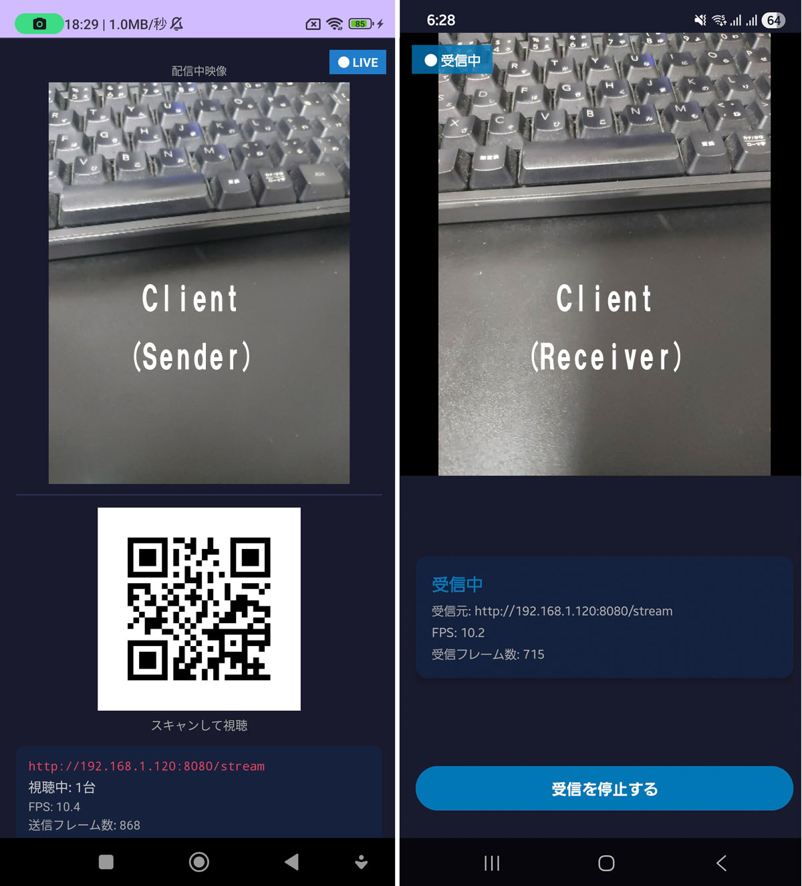
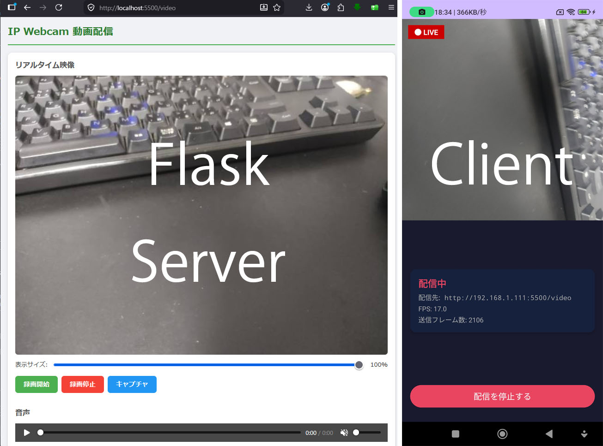

# ipwcam

[日本語版はこちら](./README.ja.md)

A prototype system that streams Android device camera footage in real time over a local area network (LAN). Supports two independent modes — direct device-to-device streaming with no server required, and browser-based viewing via a Flask server.



*App main screen — choose a mode to get started*

---

## System Overview

### Mode 1 — Direct Device-to-Device (no server required)

```
[Sender Android] --MJPEG HTTP (built-in server)--> [Receiver Android]
```

One device acts as a streaming server and displays a QR code. The other device scans the QR code and views the live feed directly in the app — no PC or external server needed.



*Left: Sender — displays QR code and camera preview. Right: Receiver — shows the incoming live feed.*

---

### Mode 2 — Via Flask Server (browser viewing)

```
[Android Client] --MJPEG HTTP POST--> [Flask Server] --MJPEG HTTP GET--> [Browser]
```

The Android app pushes camera frames to a Flask server running on a PC. The server re-streams the video to any browser on the same network. Useful for monitoring or recording via a browser interface.



*Left: Flask server displaying the live feed in a browser. Right: Android app streaming to the server.*

---

## Repository Structure

```
ipwcam/
├── client/   # Android client app (Kotlin)
└── server/   # Receive & stream server (Python / Flask)
```

Each folder contains a detailed README.

- [Client details](./client/README.md)
- [Server details](./server/README.md)

---

## Tech Stack

| Component | Language / Framework |
|---|---|
| Android Client | Kotlin, CameraX, OkHttp, ML Kit |
| Server | Python, Flask, OpenCV |
| Frontend | HTML / JavaScript |
| Streaming Format | MJPEG (multipart/x-mixed-replace) |

---

## Quick Start

### Mode 1 — Direct Device-to-Device

Install the app on both devices. No PC or server setup required.

**Sender device:**
1. Tap **"Show QR code and start streaming"**
2. A QR code and camera preview are displayed

**Receiver device:**
1. Tap **"Scan QR code and start receiving"**
2. Scan the QR code shown on the sender
3. The live feed appears in the app

### Mode 2 — Via Flask Server

#### 1. Start the server (PC)

```bash
cd server
./setup.sh   # First time only
./start.sh   # Start Flask server (port 5500)
```

#### 2. Build and install the Android app

Open the `client` project in Android Studio and build it, or run:

```bash
cd client
./gradlew assembleDebug
```

#### 3. Connect from the Android app

- Tap **"Scan QR code and start streaming"** and scan the QR displayed in the browser
- Or tap **"Connect and start streaming"** after entering the server URL manually

Open `http://<server IP>:5500` in a browser to view the live feed.

---

## Requirements

| Target | Requirement |
|---|---|
| Android Device | Android 8.0 or later (API 26+) |
| Server OS | Linux / macOS (bash environment) |
| Python Version | Python 3.x |
| Network | All devices must be on the same LAN |

---

## License

MIT License — see [LICENSE](./LICENSE) for details.
