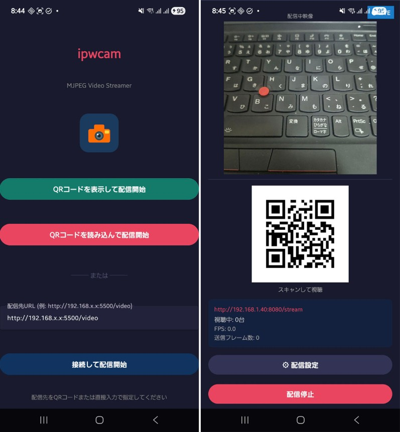

# ipwcam

[日本語版はこちら](./README.ja.md)

A prototype system that streams Android device camera footage to a PC browser in real time over a local area network (LAN).
<br>


## System Overview

```
[Android Device] --MJPEG over HTTP POST--> [Flask Server] --MJPEG over HTTP GET--> [Browser]
```

The Android app pushes camera frames in MJPEG format to a Flask server, which then streams them directly to a browser. The server URL can be specified by scanning a QR code or entering it manually.

## Repository Structure

```
ipwcam/
├── client/   # Android client app (Kotlin)
└── server/   # Receive & stream server (Python / Flask)
```

Each folder contains a detailed README.

- [Client details](./client/README.md)
- [Server details](./server/README.md)

## Tech Stack

| Component | Language / Framework |
|---|---|
| Android Client | Kotlin, CameraX, OkHttp, ML Kit |
| Server | Python, Flask, OpenCV |
| Frontend | HTML / JavaScript |
| Streaming Format | MJPEG (multipart/x-mixed-replace) |

## Quick Start

### 1. Start the server

```bash
cd server
./setup.sh   # First time only
./start.sh   # Start Flask server (port 5500)
```

### 2. Build the Android app

Open the client project in Android Studio and build it.

```bash
cd client
./gradlew assembleDebug
```

### 3. Connect

1. Open `http://<server IP address>:5500` in a browser
2. Scan the displayed QR code with the Android app, or enter the URL manually
3. Tap "Start Streaming" in the app — the video feed will begin

## Requirements

| Target | Requirement |
|---|---|
| Android Device | Android 8.0 or later (API 26+) |
| Server OS | Linux / macOS (bash environment) |
| Python Version | Python 3.x |
| Network | Client and server must be on the same LAN |

## License

MIT License — see [LICENSE](./LICENSE) for details.
